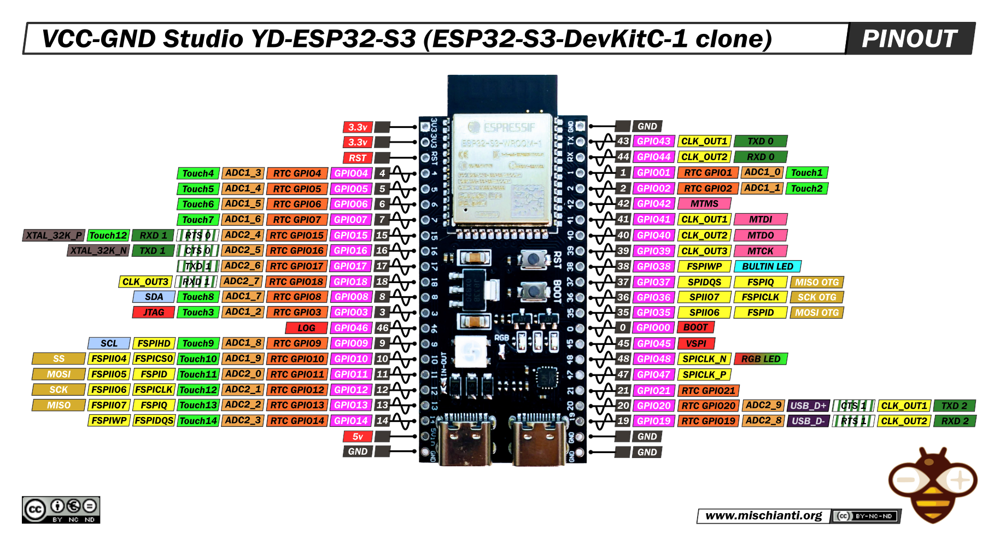

# Firmware files for meshy-tron

The firmware is based off the arduino platform and uses the command line version of the ide known as [`arduino-cli`](https://github.com/arduino/arduino-cli). 
Meshy-tron uses an esp32s3 clone board with the following pinout.

# Instructions

### Step 1. Install `arduino-cli`
You can find the installation instructions [here](https://arduino.github.io/arduino-cli/latest/installation).
___
### Step 2. Clone the repository and checkout to the master branch
___
### Step 3. Install the core and dev-tools
`cd` to the cloned repository and run `make dev`. 
> This will take a few minutes to download.

___
### Step 4. Time to compile!
run `make`. 
> This will produce a set of bin files under a directory called build.

___
### Step 5. Upload
connect the meshy-tron though usb and run `make upload-all`.

> Upload is slow and will take several seconds as its through UART. Hopefully switching to USB in the future. It's recommeded that `make upload` is used after the first `make upload-all`. This skips uploading the bootloader and the partition info shaving a few seconds.